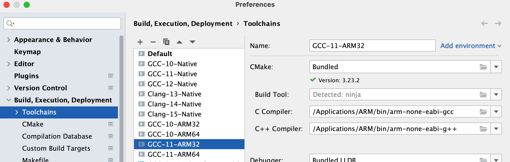
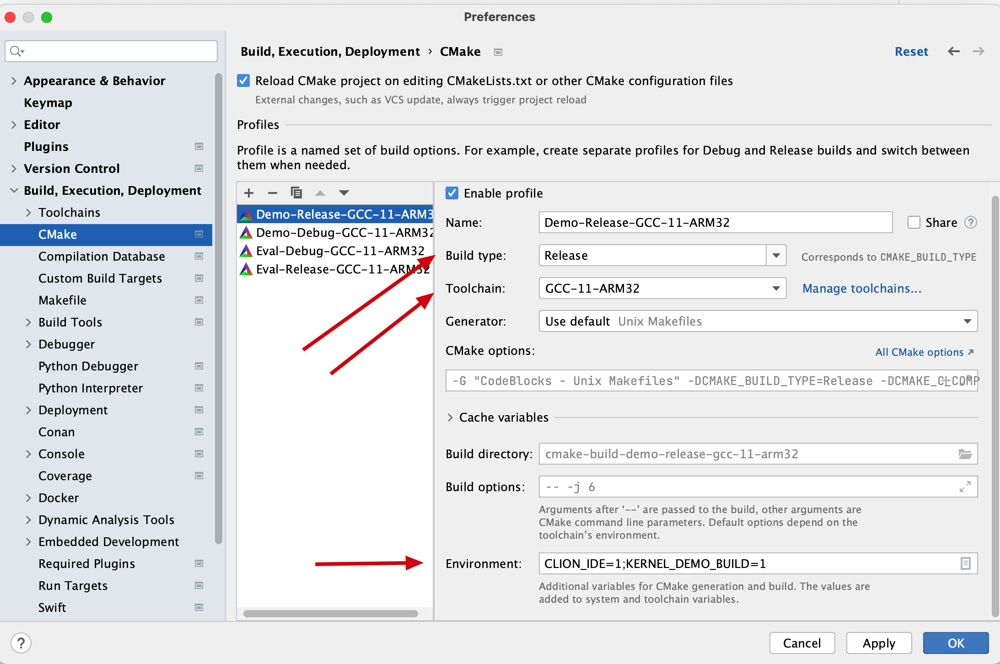
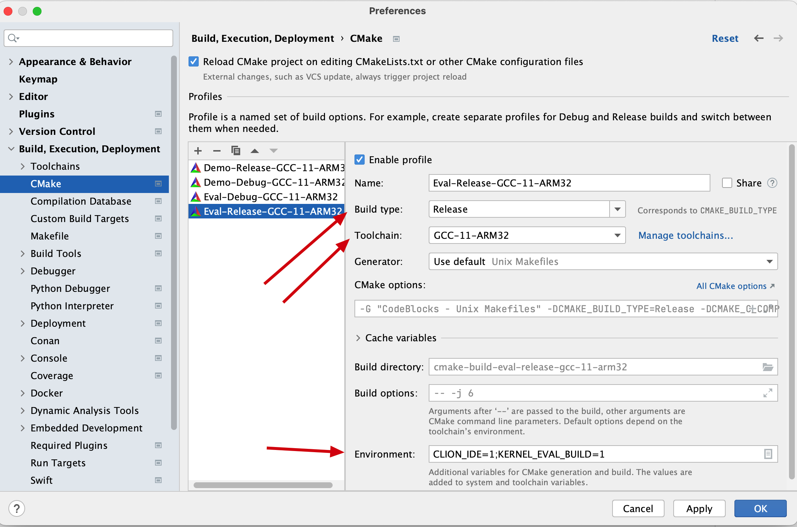
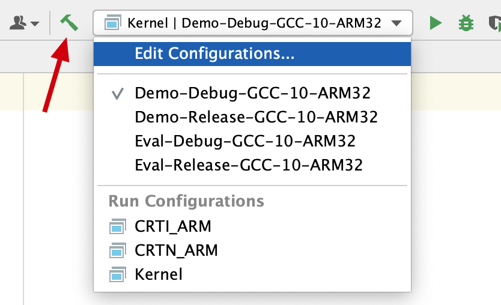

## IDE Setup: CLion

This page documents how to set up CLion to compile the sample kernel.  

### Step 1: Clone the repository with all Tinkertoy modules

```bash
git clone https://github.com/0xTinkertoy/Kernel-Moisture.git
cd Kernel-Moisture
git submodule update --init
```

You may now open the project folder in CLion.

### Step 2: Configure the compiler toolchain

*For demonstration, we will use GCC 11 (11.3.rel1) downloaded from ARM to compile the sample kernel on macOS.*

Open the CLion setting panel, navigate to **Build, Execution, Deployment > Toolchains**, and add a new entry named `GCC-11-ARM32`.
Type the path to `gcc`/`g++` in the C/C++ compiler field.



### Step 3: Configure the CMake

Open the CLion setting panel, navigate to **Build, Execution, Deployment > CMake**, and select the `GCC-11` toolchain for both Debug and Release builds.
The sample kernel can be built for demonstration or evaluation.  
The kernel built for evaluation will have timer disabled and `kprintf` and serial driver removed.
You need to define two environment variables:
- `CLION_IDE=1` so that the provided `CMakeLists.txt` will use the compiler toolchain set by CLion.
- `KERNEL_DEMO_BUILD=1` if you want to build the kernel for demonstration or
- `KERNEL_EVAL_BUILD=1` if you want to build the kernel for evaluation.




### Step 4: Reload the CMake project

Click **File > Reload CMake** Project to activate provided `CMakeLists.txt`.  
Once the project is loaded successfully, you should be able to see a target named `Kernel`.  
You can now click the hammer icon to build the sample kernel.


